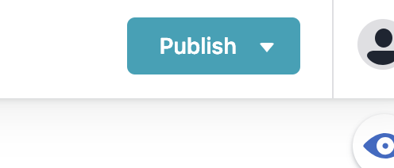

# Storj.io
by Faris Huskovic

## Table Of Contents
---
- Improvements
- How to for Marketing
- How to for Engineering

## Improvements
---

### Modular codebase

Pages are broken down into infinitely re-usable sections called "partials".

This helps prevent wasting time skimming 1000+ lines of html for a closing div tag and has substiantally reduced
the number of lines of code.

### CMS for Marketing Team
The Website now has a CMS where the marketing team can update the verbage and images on the website.

The website should accurately reflect our current stage of production. Twice as many updates can be completed in half the time now that the marketing team can make them directly.

### Faster Web Development
In the screenshot below on the left hand side you can see the footer partial which has some hugo logic in it that allows you to propogate new elements based on certain data. On the right hand side you see two pages both using that footer partial. Now any updates made to the footer automatically update across all pages using that partial. This saves a lot of time from having to make the update on each page manually.

## How to for Marketing
---

If you've been whitlisted, you should be able to access the CMS by appending "/admin" to the site's url the same way you do for the blog.

Once in, you'll see the collections on your left. These represent either a whole page, or a certain part/section of a page. When you click on a collection you'll see the elements that make it up in the form of editable markdown files in the middle of the screen.

You can create a new article by clicking on "new press articles" in the screenshot above.
Adding new media articles to our press page can be done now in the same time it takes to .........Ohhh, idk, put it in a google sheet?

Publish your changes using the "publish" button in the upper right hand corner. This pushes the update to the website live in realtime.

NOTE: The preview section is not meant to show you a preview of what the page would look like with adjustments. It is just rendering your input as a markdown file allowing you to format your input and check selected images are working.

## How to for Engineering
---

Hugo uses the Golang "html/template" package allowing you to manipulate your markup with logic similar to JSX in React or EJS in Express. Partials are similar to EJS partials in Express and/or Components in React.

Directory tree
